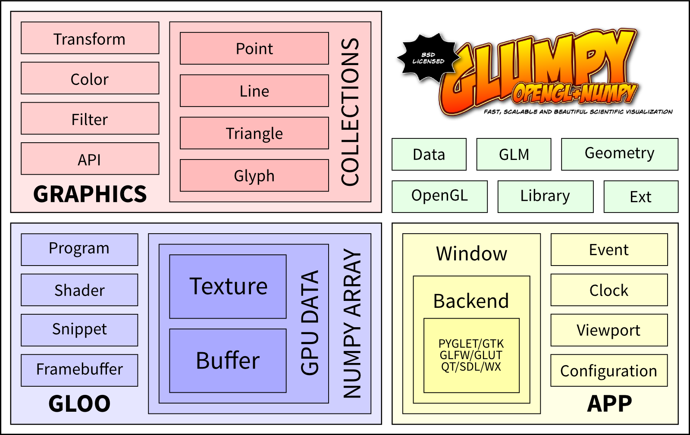

============
Architecture
============

Glumpy is organized around three main packages as illustrated below:

The :doc:`app` package is responsible for opening a window and handling user
events such as mouse and keyboard interactions. The :doc:`gloo` package is
responsible for handling shader programs and syncing CPU/GPU data through the
numpy interface. The :doc:`graphics` package provides higher-level common
objects such as text, collections and widgets.

..
   The overall package organization is as follows:

   App
   ===
   * **clock**         : Clock
   * **console**       : Debug console
   * **options**       : Command line options
   * **configuration** : Default configuration
   * **window**

     * **backends** : Backend specific code
     * **event**    : Event dispatcher
     * **mouse**    : Mouse events
     * **keyboard** : Keyboard events
     * **window**   : Abstract window

   Gloo
   ====
   * **globject** : Abstract object that lives on both CPU & GPU
   * **gpudata**  : GPU aware numpy array
   * **program**  : GPU Program
   * **parser**   : GLSL parser
   * **shader**   : Programmable shader (Vertex/Fragment/Geometry)
   * **snippet**  : Reusable GLSL snippet
   * **variable** : Shader variable (attribute or uniform)
   * **buffer**   : GPU buffer (VertexBuffer/IndexBuffer)
   * **texture**  : GPU texture (1D/2D/3D)
   * **atlas**    : 2D Texture atlas
   * **uniforms** : Collection of uniforms stored in 2D texture

   Graphics
   ========
   * **text**        : Text related objects
   * **widgets**     : Interactive widgets
   * **collections**

     * **points**    : Points collection
     * **lines**     : Lines collection
     * **triangles** : Triangles collection
     * **quads**     : Quads collection

   Others
   ======

   * **geometry**   : Geometry related functions
   * **transforms** : Shader transformation snippets
   * **shaders**    : Actual shader code
   * **gl**         : OpenGL access
   * **glm**        : Simple 3D matrix transforms
   * **ext**        : External packages
