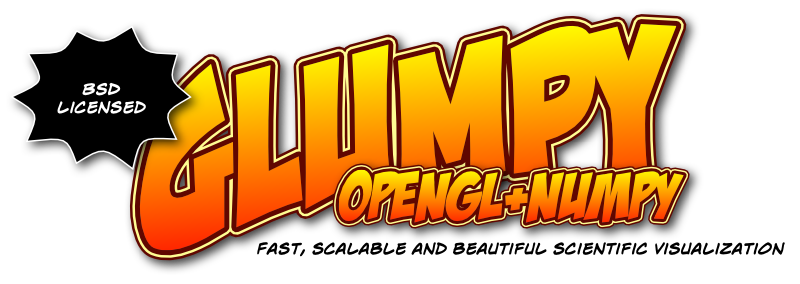

.. _Glumpy:     https://glumpy.github.io
.. _matplotlib: http://matplotlib.org
.. _bokeh:      http://bokeh.pydata.org
.. _cairo:      http://cairographics.org
.. _OpenGL:     http://www.opengl.org
.. _Jupyter:    https://jupyter.org

====================
Glumpy documentation
====================

`Glumpy`_ is an `OpenGL`_-based interactive visualization library in
Python. Its goal is to make it easy to create fast, scalable, beautiful,
interactive and dynamic visualizations. The main documentation for the site is
organized into a couple of sections:

Important links
===============

======================= ====================================================
**Source repository**   https://github.com/glumpy/glumpy
**Issue tracker**       https://github.com/glumpy/glumpy/issues
**Website**             http://glumpy.github.io
**Gallery**             http://glumpy.github.io/gallery.html
**Documentation**       http://glumpy.readthedocs.org/en/latest/
**Chatroom**            https://gitter.im/glumpy/chatroom
**Mailing list**        https://groups.google.com/forum/#!forum/glumpy-users
======================= ====================================================

Development status
==================

Glumpy is still under active development (as of January 2016) and is already
pretty much useable (for the hacker). Future development includes:

 * **Short term** (6 months):

   * Documentation (work in progress)
   * Collection update mechanism
   * Write the Wx2,Wx3 and GTK3 backends
   * Write some real-world user case examples (any idea ?)
     
 * **Long term** (2/3 years):

   * SVG viewer (see `seagull <https://bitbucket.org/rndblnch/seagull>`_)
   * Minimal widget toolkit (see `nanovg <https://github.com/memononen/nanovg>`_)
   * Python OpenGL terminal (see `glipy <http://www.labri.fr/perso/nrougier/coding/glipy/index.html>`_)
   * Foreign API (matplotlib_, cairo_ & bokeh_)
   * Jupyter_ integration

You can help by reporting bugs & typos, writing (or asking for) some examples
in your scientific domain, writing documentation, `hiring me
<mailto:Nicolas.Rougier@inria.fr>`_ for one year to work fulltime on glumpy,
etc.
     

.. ----------------------------------------------------------------------------  
.. _user-docs:

.. toctree::
   :maxdepth: 1
   :caption: User Documentation

   installation
   quickstart
   examples
   numpy
   options
   faq

.. ----------------------------------------------------------------------------  
.. _opengl-docs:

.. toctree::
   :maxdepth: 1
   :glob:
   :caption: OpenGL tutorial

   tutorial/introduction
   tutorial/hardway
   tutorial/easyway
   tutorial/cube-ugly
   tutorial/cube-nice
   tutorial/resources

.. ----------------------------------------------------------------------------  
.. _dev-docs:

.. toctree::
   :maxdepth: 1
   :caption: Developer Documentation

   snippet
   
.. ----------------------------------------------------------------------------  
.. _api-docs:

.. toctree::
   :maxdepth: 1
   :caption: Application Program Interface

   api/architecture
   api/app
   api/gloo
   api/graphics
