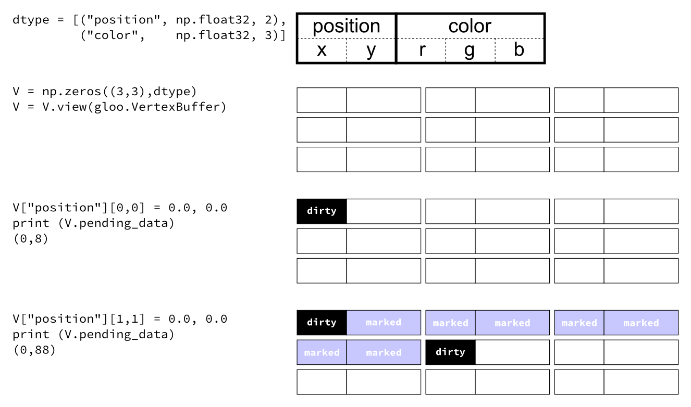

.. _gloo-quad.py: https://github.com/glumpy/glumpy/blob/master/examples/gloo-quad.py

=================
Numpy integration
=================

Glumpy is based on a tight and seamless integration with numpy arrays. This
means you can manipulate GPU data as you would with regular numpy arrays and
glumpy will take care of the rest. But an example is worth a thousand words:

.. code::

   from glumpy import gloo

   dtype = [("position", np.float32, 2),  # x,y
            ("color",    np.float32, 3)]  # r,g,b
   V = np.zeros((3,3),dtype).view(gloo.VertexBuffer)
   V["position"][0,0] = 0.0, 0.0
   V["position"][1,1] = 0.0, 0.0
   
   
V is a :any:`VertexBuffer` which is both a :any:`GPUData` and a numpy
array. When V is modified, glumpy takes care of computing the smallest
contiguous block of dirty memory since it was last uploaded to GPU memory. When
this buffer is to be used on the GPU, glumpy takes care of uploading the
"dirty" area at the very last moment. This means that if you never use V,
nothing will be ever uploaded to the GPU! In the case above, the last computed
"dirty" area is made of 88 bytes starting at offset 0 as illustrated below:

.. note::

   When a buffer is created, it is marked as totally dirty, but for the sake of
   illustration, just pretend this is not the case here.
           
Glumpy will thus end up uploading 88 bytes while only 16 bytes have been
actually modified. You might wonder if this optimal. Actually, most of the time
it is. Uploading some data to a buffer requires a lot of operations on the GL
side and each call has a fixe cost. For example, consider the gloo-quad.py_
example from the examples directory. If you start this program with the
``--debug`` flag, you'll see what is really happening in the shadow to just
display this simple quad:

.. code::

   $ python gloo-quad.py -f 1 --debug
   [i] HiDPI detected, fixing window size
   [i] Using GLFW (GL 2.1)
   [i] Running at 1 frames/second
   GPU: Creating program
   GPU: Attaching shaders to program
   GPU: Creating shader
   GPU: Compiling shader
   GPU: Creating shader
   GPU: Compiling shader
   GPU: Linking program
   GPU: Activating program (id=1)
   GPU: Activating buffer (id=5)
   GPU: Creating buffer (id=5)
   GPU: Deactivating buffer (id=5)
   GPU: Activating buffer (id=5)
   GPU: Updating position
   GPU: Deactivating buffer (id=5)
   GPU: Deactivating program (id=1)
   GPU: Activating program (id=1)
   GPU: Activating buffer (id=5)
   GPU: Deactivating buffer (id=5)
   GPU: Deactivating program (id=1)
   GPU: Activating program (id=1)
   GPU: Activating buffer (id=5)
   GPU: Deactivating buffer (id=5)
   GPU: Deactivating program (id=1)

The glumpy philosophy is thus to minimize GL calls and to try to merge any
buffer update operations into a single call sequence, even if it is suboptimal
in some cases.

.. note::

   Note that you can nevertheless optimize the code above by splitting the
   buffer into one vertex buffer for colors and one vertex buffer for
   positions. If colors are rather static and positions rather dynamic, you'll
   save the cost of uploading colors each time you change some positions.

