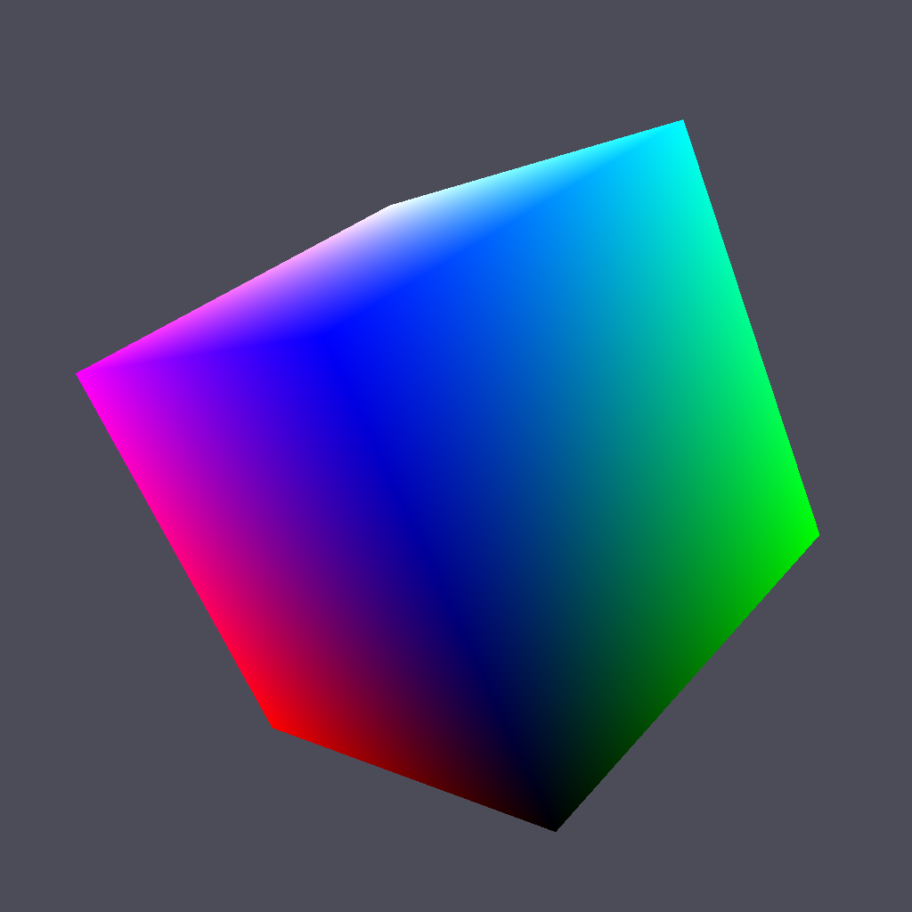
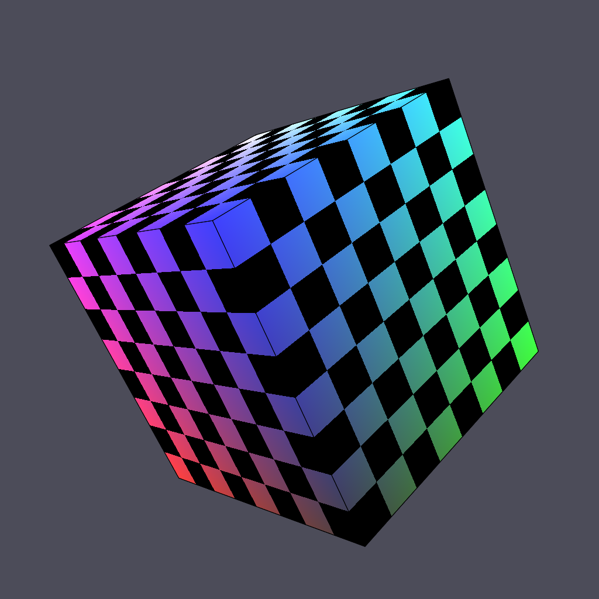
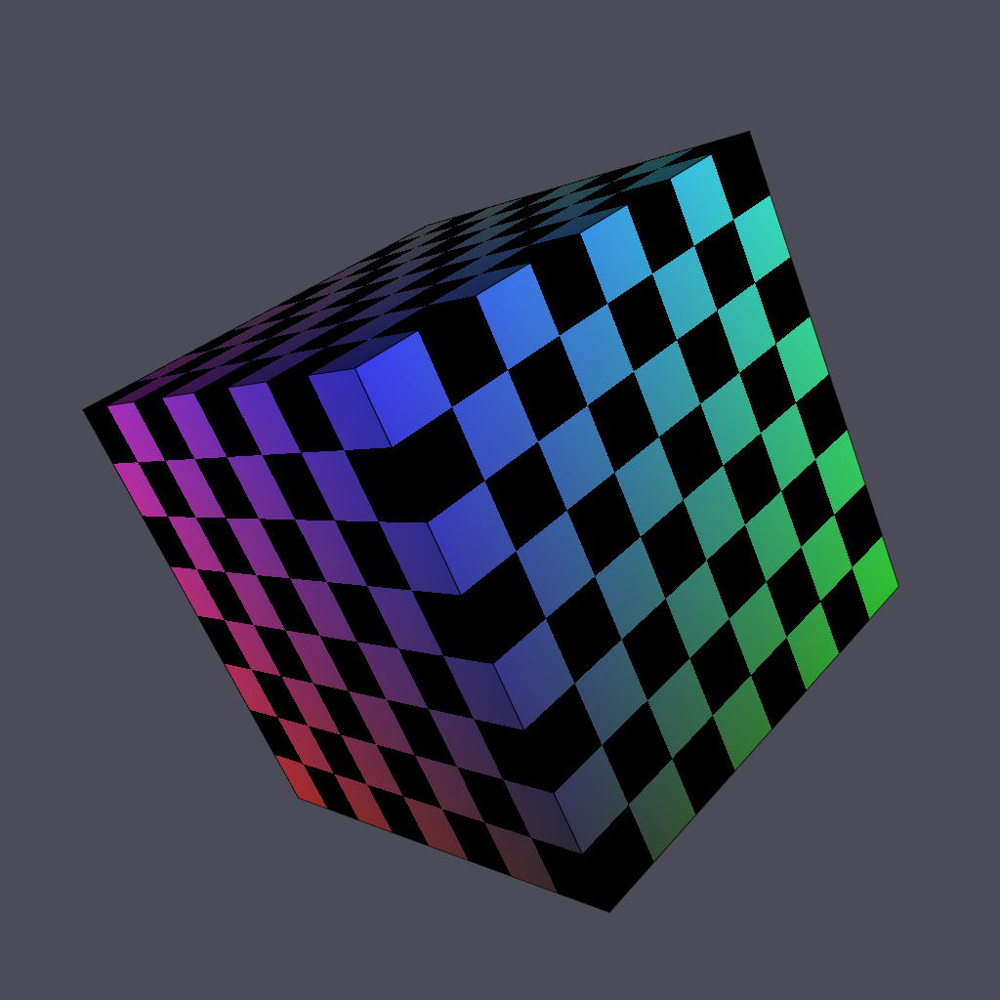

======================
Color, light & texture
======================

Let's continue our OpenGL exploration using the same cube example as in previous
section.

Colored cube
============

Now we'll discover why glumpy is so useful. To add color per vertex to the
cube, we simply define the vertex structure as:

.. code::

   V = np.zeros(8, [("a_position", np.float32, 3),
                    ("a_color",    np.float32, 4)])
   V["a_position"] = [[ 1, 1, 1], [-1, 1, 1], [-1,-1, 1], [ 1,-1, 1],
                      [ 1,-1,-1], [ 1, 1,-1], [-1, 1,-1], [-1,-1,-1]]
   V["a_color"]    = [[0, 1, 1, 1], [0, 0, 1, 1], [0, 0, 0, 1], [0, 1, 0, 1],
                      [1, 1, 0, 1], [1, 1, 1, 1], [1, 0, 1, 1], [1, 0, 0, 1]]

And we're done ! Well, actually, we also need to slightly modify the vertex
shader since color is now an attribute (and not a constant).

.. code::

   vertex = """
   uniform mat4   u_model;         // Model matrix
   uniform mat4   u_view;          // View matrix
   uniform mat4   u_projection;    // Projection matrix
   attribute vec4 a_color;         // Vertex color
   attribute vec3 a_position;      // Vertex position
   varying vec4   v_color;         // Interpolated fragment color (out)
   void main()
   {
       v_color = u_color;
       gl_Position = u_projection * u_view * u_model * vec4(a_position,1.0);
   } """

   fragment = """
   varying vec4   v_color;         // Interpolated fragment color (in)
   void main()
   {
       gl_FragColor = v_color;
   } """

Furthermore, since our vertex buffer fields corresponds exactly to program
attributes, we can directly bind it:

.. code::

   cube = gloo.Program(vertex, fragment)
   cube.bind(V)

.. note::

   You could also have written

   .. code::

      cube = gloo.Program(vertex, fragment)
      cube["a_position"] = V["a_position"]
      cube["a_color"] = V["a_color"]
      
If you look closely at shader source, you'll see a new type of shader variable:

.. code:: C

   varying vec4 v_color; 

This variable is a varying meaning it is interpolated between the vertex and
the fragment stage. We just need to tell OpenGL the color of each vertex and it
will compute the inteprolated color for each fragment, giving us a nice colored
cube.
   
For the lazy: `color-cube.py <https://github.com/glumpy/glumpy/blob/master/examples/tutorial/color-cube.py>`_

Outlined cube
=============

We can make the cube a bit nicer by outlining it using black lines. To outline
the cube, we need to draw lines between couple of vertices on each face. 4
lines for the back and front face and 2 lines for the top and bottom faces. Why
only 2 lines for top and bottom ? Because lines are shared between the
faces. So overall we need 12 lines and we need to compute the corresponding
indices (I did it for your):

.. code:: python

    O = [0,1, 1,2, 2,3, 3,0,
         4,7, 7,6, 6,5, 5,4,
         0,5, 1,6, 2,7, 3,4 ]
    O = O.view(gloo.IndexBuffer)

We then need to draw the cube twice. One time using triangles and the indices
index buffer and one time using lines with the outline index buffer.  We need
also to add some OpenGL black magic to make things nice. It's not very
important to understand it at this point but roughly the idea to make sure lines
are drawn "above" the cube because we paint a line on a surface.

Textured cube
=============

.. code:: 

   def cube():
       vtype = [('a_position', np.float32, 3),
                ('a_texcoord', np.float32, 2),
                ('a_normal',   np.float32, 3),
                ('a_color',    np.float32, 4)]
       itype = np.uint32

       # Vertices positions
       p = np.array([[1, 1, 1], [-1, 1, 1], [-1, -1, 1], [1, -1, 1],
                     [1, -1, -1], [1, 1, -1], [-1, 1, -1], [-1, -1, -1]], dtype=float)

       # Face Normals
       n = np.array([[0, 0, 1], [1, 0, 0], [0, 1, 0],
                     [-1, 0, 1], [0, -1, 0], [0, 0, -1]])

       # Vertice colors
       c = np.array([[0, 1, 1, 1], [0, 0, 1, 1], [0, 0, 0, 1], [0, 1, 0, 1],
                     [1, 1, 0, 1], [1, 1, 1, 1], [1, 0, 1, 1], [1, 0, 0, 1]])

       # Texture coords
       t = np.array([[0, 0], [0, 1], [1, 1], [1, 0]])

       faces_p = [0, 1, 2, 3,  0, 3, 4, 5,   0, 5, 6, 1,
                  1, 6, 7, 2,  7, 4, 3, 2,   4, 7, 6, 5]
       faces_c = [0, 1, 2, 3,  0, 3, 4, 5,   0, 5, 6, 1,
                  1, 6, 7, 2,  7, 4, 3, 2,   4, 7, 6, 5]
       faces_n = [0, 0, 0, 0,  1, 1, 1, 1,   2, 2, 2, 2,
                  3, 3, 3, 3,  4, 4, 4, 4,   5, 5, 5, 5]
       faces_t = [0, 1, 2, 3,  0, 1, 2, 3,   0, 1, 2, 3,
                  3, 2, 1, 0,  0, 1, 2, 3,   0, 1, 2, 3]

       vertices = np.zeros(24, vtype)
       vertices['a_position'] = p[faces_p]
       vertices['a_normal']   = n[faces_n]
       vertices['a_color']    = c[faces_c]
       vertices['a_texcoord'] = t[faces_t]

       filled = np.resize(
          np.array([0, 1, 2, 0, 2, 3], dtype=itype), 6 * (2 * 3))
       filled += np.repeat(4 * np.arange(6, dtype=itype), 6)

       outline = np.resize(
           np.array([0, 1, 1, 2, 2, 3, 3, 0], dtype=itype), 6 * (2 * 4))
       outline += np.repeat(4 * np.arange(6, dtype=itype), 8)

       vertices = vertices.view(gloo.VertexBuffer)
       filled   = filled.view(gloo.IndexBuffer)
       outline  = outline.view(gloo.IndexBuffer)
       
       return vertices, filled, outline

Lighted cube
============
