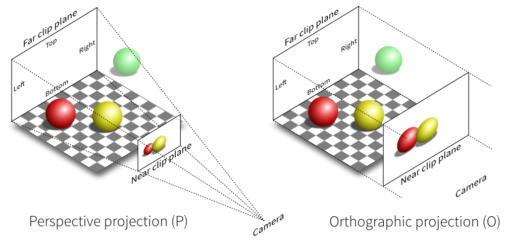
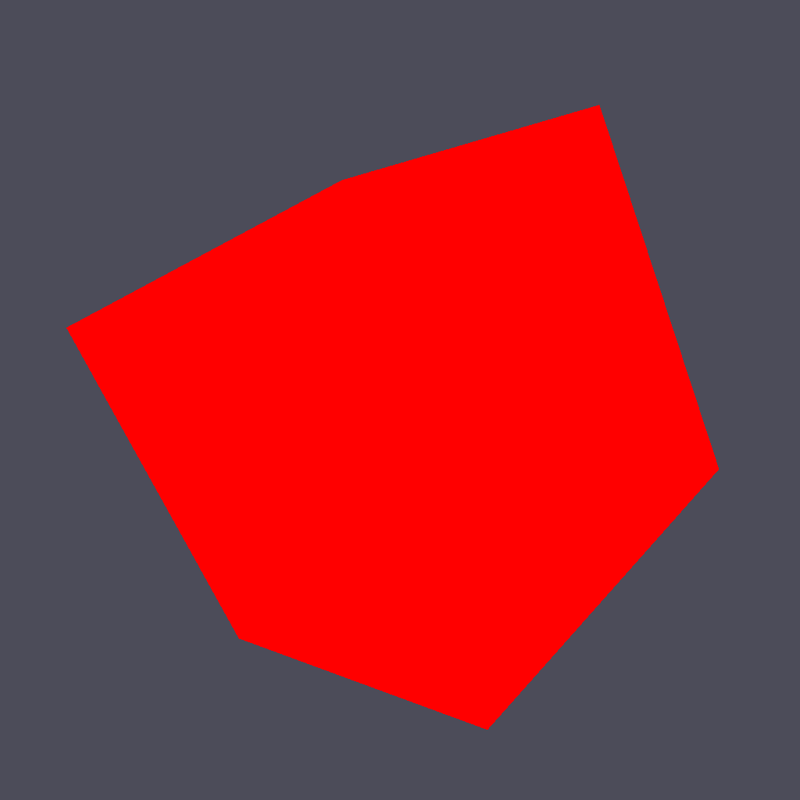

================
Rendering a cube
================

We already have all the pieces needed to render a 3D scene but we need first to
do the maths.

Projection matrix
=================

We need first to define what do we want to view, that is, we need to define a
viewing volume such that any object within the volume (even partially) will be
rendered while objects outside won't. On the image below, the yellow and red
spheres are within the volume while the green one is not and does not appear on
the projection.

There exist many different ways to project a 3D volume onto a 2D screen but
we'll only use the `perspective projection
<https://en.wikipedia.org/wiki/Perspective_(graphical)>`_ (distant objects
appear smaller) and the `orthographic projection
<https://en.wikipedia.org/wiki/Orthographic_projection_(geometry)>`_ which is a
parallel projection (distant objects have the same size as closer ones) as
illustrated on the image above. Until now (previous section), we have been
using implicitly an orthographic projection in the z=0 plane.

.. note::

   In older versions of OpenGL, these matrices were available as `glFrustum
   <https://www.opengl.org/sdk/docs/man2/xhtml/glFrustum.xml>`_ and `glOrtho
   <https://www.opengl.org/sdk/docs/man2/xhtml/glOrtho.xml>`_.

Depending on the projection we want, we will use one of the two projection matrices
below:

**Perspective matrix**

.. image:: ../_static/frustum-matrix.png
   :width: 75%

**Orthographic matrix**

.. image:: ../_static/ortho-matrix.png
   :width: 75%

At this point, it is not necessary to understand how these matrices were built.
Suffice it to say they are standard matrices in the 3D world. Both suppose the
viewer (=camera) is located at position (0,0,0) and is looking in the direction
(0,0,1).

There exists a second form of the perpective matrix that might be easier to
manipulate. Instead of specifying the right/left/top/bottom planes, we'll use
field of view in the horizontal and vertical direction:

**Perspective matrix**

.. image:: ../_static/perspective-matrix.png
   :width: 75%

where ``fovy`` specifies the field of view angle, in degrees, in the y
direction and ``aspect`` specifies the aspect ratio that determines the field
of view in the x direction.

Model and view matrices
=======================

We are almost done with matrices. You may have guessed that the above matrix
requires the viewing volume to be in the z direction. We could design our 3D
scene such that all objects are withing this direction but it would not be very
convenient. So instead, we'll use a view matrix that will map the the world
space to camera space. This is pretty much as if we were orienting the camera
at a given position and look toward a given direction. In the meantime, we can
further refine the whole pipeline by providing a model matrix that will maps
the object's local coordinate space into world space. For example, this wil be
useful for rotating an object around its center. To sum up, we need:

* **Model matrix** maps from an object's local coordinate space into world space
* **View matrix** maps from world space to camera space
* **Projection matrix** maps from camera to screen space

Now, we can write out shaders:

.. code:: python

   vertex = """
   uniform mat4   u_model;         // Model matrix
   uniform mat4   u_view;          // View matrix
   uniform mat4   u_projection;    // Projection matrix
   attribute vec3 a_position;      // Vertex position
   void main()
   {
       gl_Position = u_projection * u_view * u_model * vec4(a_position,1.0);
   } """

   fragment = """
   void main()
   {
       gl_FragColor = vec4(1.0, 0.0, 0.0, 1.0);
   } """

  

Building a cube
===============

We need to define what we mean by a *cube* since there is not such thing as as
cube in OpenGL. A cube, when seen from the outside has 6 faces, each being a
square. We just saw that to render a square, we need two triangles. So, 6
faces, each of them being made of 2 triangles, we need 12 triangles.

How many vertices? 12 triangles × 3 vertices per triangles = 36 vertices might
be a reasonable answer. However, we can also notice that each vertex is part of
3 different faces actually. Instead we'll use no more than 8 vertices and tell
explicitly OpenGL what to draw with them:

.. code:: python
            
   V = np.zeros(8, [("a_position", np.float32, 3)])
   V["a_position"] = [[ 1, 1, 1], [-1, 1, 1], [-1,-1, 1], [ 1,-1, 1],
                      [ 1,-1,-1], [ 1, 1,-1], [-1, 1,-1], [-1,-1,-1]]

These describe vertices of a cube cented on (0,0,0) that goes from (-1,-1,-1)
to (+1,+1,+1). Then we compute (mentally) what are the triangles for each face, i.e. we
describe triangles in terms of vertices index (relatively to the ``V`` array we
just defined):

.. code:: python

   I = np.array([0,1,2, 0,2,3,  0,3,4, 0,4,5,  0,5,6, 0,6,1,
                 1,6,7, 1,7,2,  7,4,3, 7,3,2,  4,7,6, 4,6,5], dtype=np.uint32)

We now need to upload these data to the GPU. Using gloo, the easiest way is to use a VertexBuffer for vertices data and an IndexBuffer for indices data:

.. code:: python

   V = V.view(gloo.VertexBuffer)
   I = I.view(gloo.IndexBuffer)

   cube = gloo.Program(vertex, fragment)
   cube["a_position"] = V

We'll use the indices buffer when rendering the cube.
  
  
Building matrices
=================

.. Note::

   Note that the view matrix is a translation along z. We actually move away
   from the center while looking into the (positive) z direction.

All the common matrix operations can be found in the ``glumpy.glm`` module
that defines ortho, frustum and perspective matrices as well as rotation,
translation and scaling operations. We won't say much more about these and you
might want to read a book about geometry to understand how this work,
especially when compositing rotation, translation and scaling (order is
important):

.. code:: python

   view = np.eye(4,dtype=np.float32)
   model = np.eye(4,dtype=np.float32)
   projection = np.eye(4,dtype=np.float32)
   glm.translate(view, 0,0,-5)
   cube['u_model'] = model
   cube['u_view'] = view
   cube['u_projection'] = projection
   phi, theta = 0,0

It is now important to update the projection matrix whenever the window is
resized (because aspect ratio may have changed):

.. code:: python

   @window.event
   def on_resize(width, height):
      ratio = width / float(height)
      cube['u_projection'] = glm.perspective(45.0, ratio, 2.0, 100.0)

Rendering
=========

Rotating the cube means computing a model matrix such that the cube rotate
around its center. We'll do that in the draw function and rotate the cube
around the z axis (theta), then around the y axis (phi):

.. code:: python

   @window.event
   def on_draw(dt):
       global phi, theta
       window.clear()
       cube.draw(gl.GL_TRIANGLES, I)

       # Make cube rotate
       theta += 0.5 # degrees
       phi += 0.5 # degrees
       model = np.eye(4, dtype=np.float32)
       glm.rotate(model, theta, 0, 0, 1)
       glm.rotate(model, phi, 0, 1, 0)
       cube['u_model'] = model

We're now alsmost ready to render the whole scene but we need first to modify
the initialization a little bit to enable depth testing:

.. code:: python
            
   @window.event
   def on_init():
       gl.glEnable(gl.GL_DEPTH_TEST)

This is needed because we're now dealing with 3D, meaning some rendered
triangles may be behind some others. OpenGL will take care of that provided we
declared our context with a depth buffer which is the default in glumpy.

`Complete source code <https://github.com/glumpy/glumpy/blob/master/examples/tutorial/solid-cube.py>`_ is available on github.

**But... But... But is't ugly !** Yes, of course ! We have no color (but red),
no texture and no light. What did you expect ?

