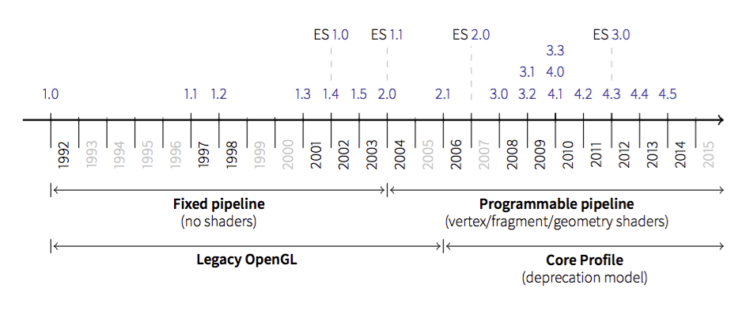
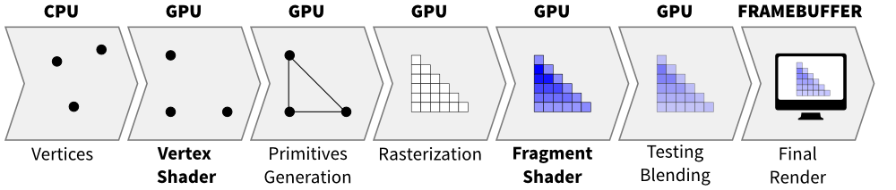

============
Introduction
============

Before diving into the core tutorial, it is important to understand that OpenGL
has evolved over the years and a big change occured in 2003 with the
introduction of the dynamic pipeline (OpenGL 2.0), i.e. the use of shaders that
allow to have direct access to the GPU.

.. note::

   ES is a light version of OpenGL for embedded systems such as tablets or
   mobiles. There also exists WebGL which is very similar to ES but is not shown on
   this graphic.

Before this version, OpenGL was using a fixed pipeline and you may still find a
lot of tutorials that still use this fixed pipeline. How to know if a tutorial
address the fixed pipeline ? It's relatively easy.  If you see GL commands such
as::

   glVertex, glColor, glLight, glMaterial
   glBegin, glEnd
   glMatrix, glMatrixMode, glLoadIdentity
   glPushMatrix, glPopMatrix
   glRect, glPolygonMode
   glBitmap, glAphaFunc
   glNewList, glDisplayList
   glPushAttrib, glPopAttrib
   glVertexPointer, glColorPointer, glTexCoordPointer, glNormalPointer

then it's most certainly a tutorial that adress the fixed pipeline.
While modern OpenGL is far more powerful than the fixed pipeline version, the
learning curve may be a bit steeper. This tutorial will try to help you start
using it.

Program and shaders
===================

.. Note::

   The shader language is called glsl.  There are many versions that goes from 1.0
   to 1.5 and subsequents version get the number of OpenGL version. Last version
   is 4.4 (February 2014).

Shaders are pieces of program (using a C-like language) that are build onto the
GPU and executed during the rendering pipeline. Depending on the nature of the
shaders (there are many types depending on the version of OpenGL you're using),
they will act at different stage of the rendering pipeline. To simplify this
tutorial, we'll use only **vertex** and **fragment** shader as shown below:

A vertex shader acts on vertices and is supposed to output the vertex
**position** (→ ``gl_Position``) on the viewport (i.e. screen). A fragment shader
acts at the fragment level and is supposed to output the **color**
(→ ``gl_FragColor``) of the fragment. Hence, a minimal vertex shader is::

  void main()
  {
      gl_Position = vec4(0.0,0.0,0.0,1.0);
  }

while a minimal fragment shader would be::

  void main()
  {
      gl_FragColor = vec4(0.0,0.0,0.0,1.0);
  }

These two shaders are not very useful since the first will transform any
vertex into the null vertex while the second will output the black color for
any fragment. We'll see later how to make them to do more useful things.

One question remains: when are those shaders exectuted exactly ? The vertex
shader is executed for each vertex that is given to the rendering pipeline
(we'll see what does that mean exactly later) and the fragment shader is
executed on each fragment that is generated after the vertex stage. For
example, in the simple figure above, the vertex would be called 3 times, once
for each vertex (1,2 and 3) while the fragment shader would be executed 21
times, once for each fragment (pixel).

Buffers and textures
====================

We explained earlier that the vertex shader act on the vertices. The question
is thus where do those vertices comes from ? The idea of modern GL is that
vertices are stored on the GPU and needs to be uploaded (only once) to the GPU
before rendering. The way to do that is to build buffers onto the CPU and to
send them onto the GPU. If your data does not change, no need to upload it
again. That is the big difference with the previous fixed pipeline where data
were uploaded at each rendering call (only display lists were built into GPU
memory).

But what is the structure of a vertex ? OpenGL does not assume anything about
your vertex structure and you're free to use as many information you may need
for each vertex. The only condition is that all vertices from a buffer have the
same structure (possibly with different content). This again is a big
difference with the fixed pipeline where OpenGL was doing a lot of complex
rendering stuff for you (projections, lighting, normals, etc.) with an implicit
fixed vertex structure. Now you're on your own...

| **Good** news is that you're now free to do anything you want.
| **Bad** news is that you have to program everything.
|

Let's take a simple example of a vertex structure where we want each vertex to
hold a position and a color. The easiest way to do that in python is to use a
structured array using the `numpy <http://www.numpy.org>`_ library::

  data = numpy.zeros(4, dtype = [ ("position", np.float32, 3),
                                  ("color",    np.float32, 4)] )

We just created a CPU buffer with 4 vertices, each of them having a
``position`` (3 floats for x,y,z coordinates) and a ``color`` (4 floats for
red, blue, green and alpha channels). Note that we explicitely chose to have 3
coordinates for ``position`` but we may have chosen to have only 2 if were to
work in two-dimensions only. Same holds true for ``color``. We could have used
only 3 channels (r,g,b) if we did not want to use transparency. This would save
some bytes for each vertex. Of course, for 4 vertices, this does not really
matter but you have to realize it **will matter** if you data size grows up to
one or ten million vertices.

Variables
=========

At this point in the tutorial, we know what are shaders and buffers but we
still need to explain how they may be connected together. So, let's consider
again our CPU buffer::

  data = numpy.zeros(4, dtype = [ ("position", np.float32, 2),
                                  ("color",    np.float32, 4)] )

We need to tell the vertex shader that it will have to handle vertices where a
position is a tuple of 2 floats and color is a tuple of 4 floats. This is
precisely what attributes are meant for. Let us change slightly our previous
vertex shader::

  attribute vec2 position;
  attribute vec4 color;
  void main()
  {
      gl_Position = vec4(position, 0.0, 1.0);
  }

This vertex shader now expects a vertex to possess 2 attributes, one named
``position`` and one named ``color`` with specified types (vec3 means tuple of
3 floats and vec4 means tuple of 4 floats). It is important to note that even
if we labeled the first attribute ``position``, this attribute is not yet bound
to the actual ``position`` in the numpy array. We'll need to do it explicitly
at some point in our program and there is no automagic that will bind the numpy
array field to the right attribute, you'll have to do it yourself, but we'll
see that later.

The second type of information we can feed the vertex shader are the uniforms
that may be considered as constant values (across all the vertices). Let's say
for example we want to scale all the vertices by a constant factor ``scale``,
we would thus write::

  uniform float scale;
  attribute vec2 position;
  attribute vec4 color;
  void main()
  {
      gl_Position = vec4(position*scale, 0.0, 1.0);
  }

Last type is the varying type that is used to pass information between the
vertex stage and the fragment stage. So let us suppose (again) we want to pass
the vertex color to the fragment shader, we now write::

  uniform float scale;
  attribute vec2 position;
  attribute vec4 color;
  varying vec4 v_color;

  void main()
  {
      gl_Position = vec4(position*scale, 0.0, 1.0);
      v_color = color;
  }

and then in the fragment shader, we write::

  varying vec4 v_color;

  void main()
  {
      gl_FragColor = v_color;
  }

The question is what is the value of ``v_color`` inside the fragment shader ?
If you look at the figure that introduced the gl pipleline, we have 3 vertices and 21
fragments. What is the color of each individual fragment ?

The answer is *the interpolation of all 3 vertices color*. This interpolation
is made using distance of the fragment to each individual vertex. This is a
very important concept to understand. Any varying value is interpolated between
the vertices that compose the elementary item (mostly, line or triangle).
